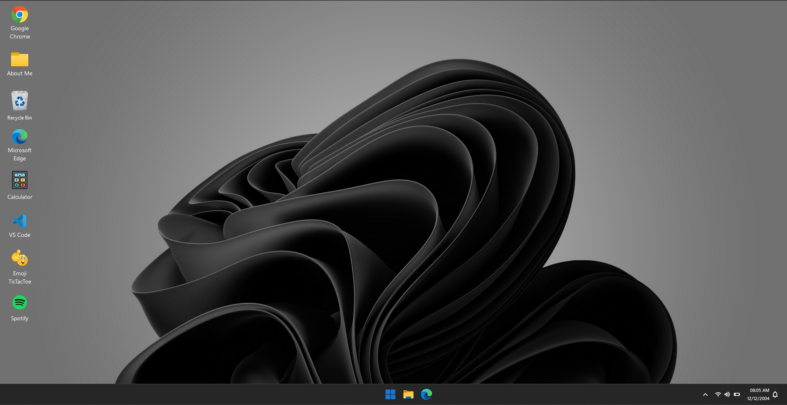
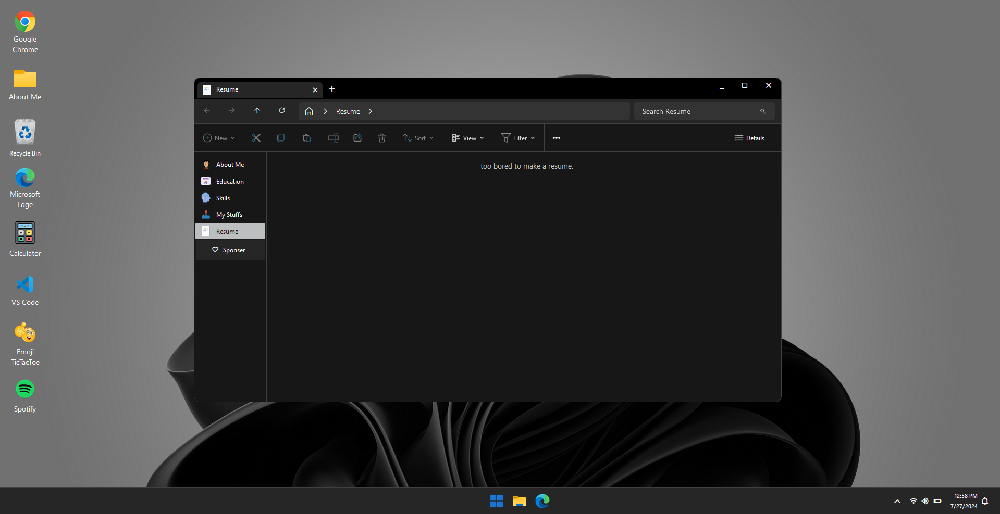
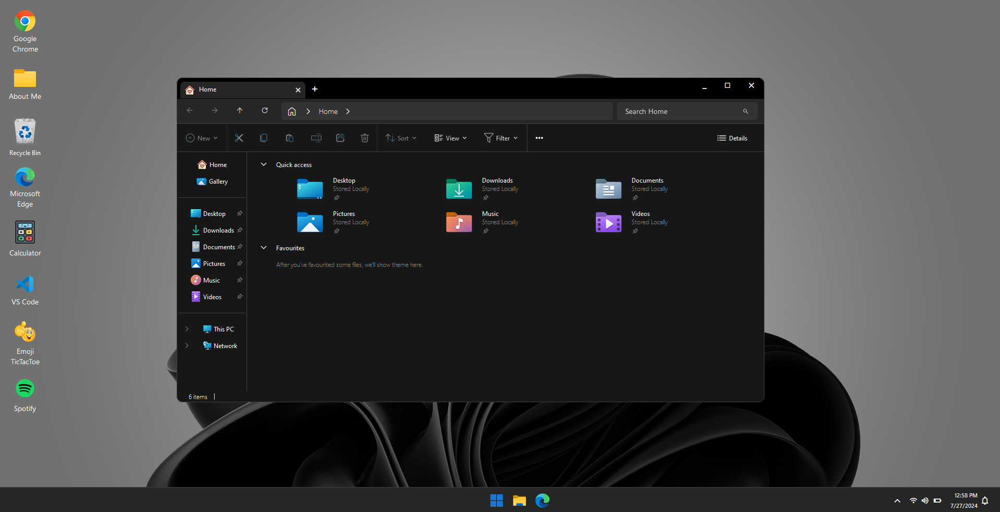

# <div style="margin:10px 0px; font-size:50px;" align="center">💼 RN Tejas Portfolio</div>

Welcome to my portfolio website built with **React.js** and styled to look like **Windows 11**! 🎉 This unique portfolio showcases my work and skills in an interactive and engaging way.

<p align="center">
    
    
</p>

## <div style="margin-left:10px;">🎨 Features

- **💻 Interactive Windows 11 Interface**: Experience my portfolio through a familiar Windows 11-like environment
- **👨‍💻 About Me**: Learn about my journey, skills, and experience
- **🎯 Project Showcase**: Browse through my featured projects with live demos and GitHub links
- **📚 Education**: View my educational background and certifications
- **🛠️ Skills**: Explore my technical skills and expertise
- **📄 Resume**: Access my professional resume

## <div style="margin-left:10px;">🚀 Tech Stack

- **⚛️ React.js**: For building the interactive user interface
- **🎨 Tailwind CSS**: For modern and responsive styling
- **🔄 React Router DOM**: For smooth navigation
- **✨ Framer Motion**: For fluid animations and transitions
- **🖱️ React Draggable**: For Windows-like window management

## <div style="margin-left:10px;">🌟 Projects

My portfolio showcases various projects including:
- Full-stack web applications
- React-based user interfaces
- Mobile-responsive designs
- API integrations
- And more!

## <div style="margin-left:10px;">💻 Local Development

1. **Clone the repository:**
   ```bash
   git clone https://github.com/Tejas-Naik/windows11
   ```

2. **Install dependencies:**
   ```bash
   cd windows11
   npm install
   ```

3. **Start the development server:**
   ```bash
   npm start
   ```

Visit [http://localhost:3000](http://localhost:3000) to view the portfolio locally.

## <div style="margin-left:10px;">📱 Contact

- **Email**: [your-email@example.com](mailto:your-email@example.com)
- **LinkedIn**: [Your LinkedIn Profile](https://linkedin.com/in/your-profile)
- **GitHub**: [Your GitHub Profile](https://github.com/your-username)

## <div style="margin-left:10px;">📸 Portfolio Sections

<p align="center">
    
    
    
    
</p>

## <div style="margin-left:10px;">🙏 Acknowledgments

Special thanks to all my mentors, colleagues, and the open-source community for their continuous support and inspiration.

<p align="center">
  
</p>

<div style="margin:20px; font-size:20px;" align="center"><strong>Thanks for visiting my portfolio! 🚀</strong></div>
